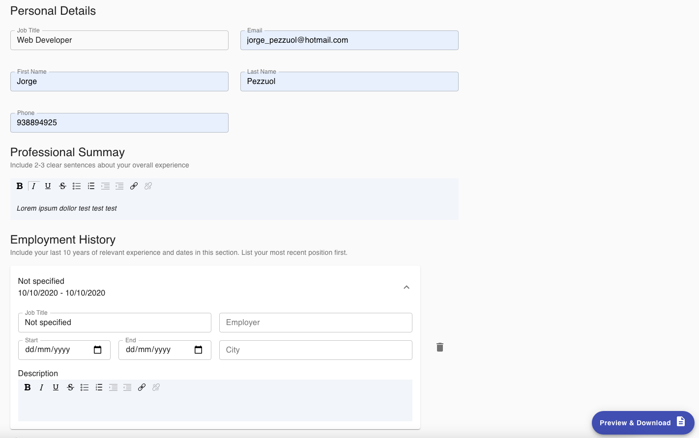
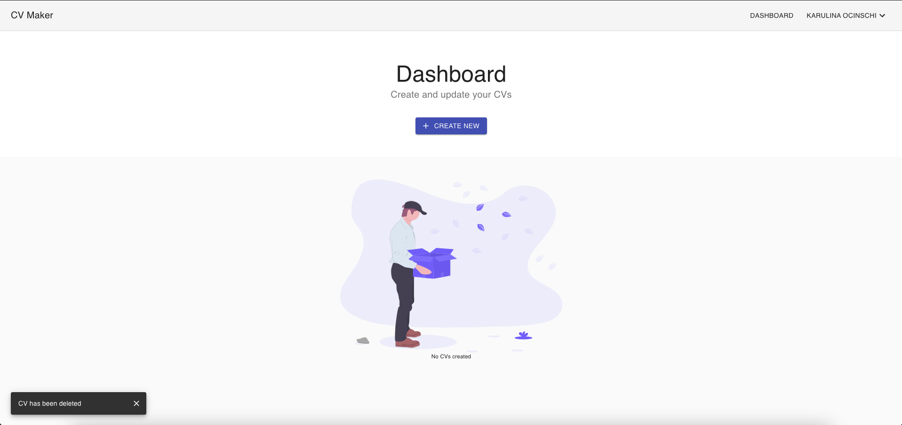
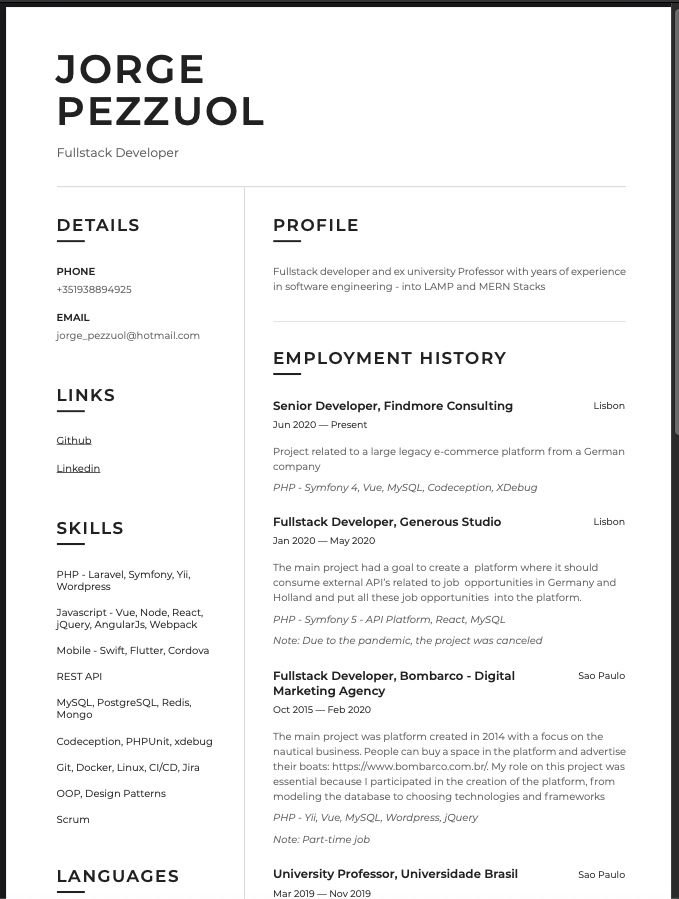

# Project Name
> Free CV Maker

## Table of contents
* [Screenshots](#screenshots)
* [Technologies](#technologies)
* [Setup](#setup)
* [Features](#features)
* [Contact](#contact)

## General info
Free CV maker: https://myindiecv.herokuapp.com/

## Screenshots

## Technologies
* React
* Node
* Express
* Puppeteer
* Material UI
* MongoDB

## Setup
nodemon server.js and cd client && npm run start

## Features
* Create your CV for free and download as pdf

## Contact
Created by [@jorgepezzuol](https://www.linkedin.com/in/jorge-pezzuol/)
